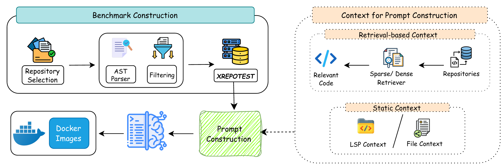

<p align="center">
    <br>
    
    <b>Benchmarking Multilingual Repository-Level Unit Test Generation for Large Language Models</b>
    <br>
    
<p>

<div align="center">

<a href="#"></a>
<a href="#"></a>
<a href="#"></a>
<a href="#"></a>
<a href="https://huggingface.co/datasets/solis-soict/xrepotest"></a>
<br>
<a href="#"></a>
<a href="#"></a>
<a href="#"></a>
<a href="#"></a>
<a href="#"></a>

</div>

---

XRepoTest is a **repository-level benchmark** for evaluating how well large language models generate unit tests for **real-world functions across five programming languages**. It provides an end-to-end pipeline: repository crawling, prompt construction, LLM response generation, and **Docker-based execution**; that compiles, runs, and measures the coverage of every generated test against the *actual* source code.

Unlike single-language or synthetic benchmarks, XRepoTest evaluates repository-level test generation in the wild, letting you compare models, prompting strategies, and retrieval-augmented contexts under uniform, real execution conditions.

---

## 📊 Highlights

- **5 languages, one pipeline.** Go, Rust, Julia, PHP, and Ruby evaluated with their native test frameworks (`go test`, `cargo test`, `Test`, `PHPUnit`, `RSpec`).
- **Real execution, not pattern-matching.** Every test is compiled and run inside a language-specific Docker container; metrics come from actual compiler/test-runner/coverage-mutator outputs.
- **4 research axes you can ablate.** `standard` → `lsp_context` → `file_context` → `rag_bm25` / `rag_dense` prompt modes.
- **Mutation testing** (`go`, `rust`, `ruby`) to measure test *quality*, not just pass rate.
- **Iterative repair** and **agentic** modes for studying self-repair and agent-driven test generation.
- **Post-run analysis suite** — data leakage, domain/error analysis, significance testing, overlap and correlation analysis.

---

## 🔍 Benchmark Overview

For each language, XRepoTest **crawls public repositories to extract function-level records**, enriches each function with contextual metadata (LSP argument/type info, focal methods, or retrieval contexts), and asks a model to write a unit test targeting that function. The generated test is then executed against the repository's real code.

### Supported languages

| Language | Extension | Test framework | Mutation tool |
|----------|-----------|----------------|---------------|
| Go       | `.go`     | `go test`      | `go-mutesting` ✅ |
| Rust     | `.rs`     | `cargo test`   | `cargo-mutants` ✅ |
| Julia    | `.jl`     | `Test`         | — |
| PHP      | `.php`    | `PHPUnit`      | `infection` |
| Ruby     | `.rb`     | `RSpec`        | `mutant` |

> Mutation testing is fully wired into the Docker evaluators for **Go, Rust, and Ruby** (the `--enable_mutation` flag affects only those three).

### Reported metrics

| Metric | Meaning |
|--------|---------|
| `compiled_rate` | % of generated tests that compile |
| `invocation_rate` | % that actually invoke the focal function |
| `test_pass_rate` | % that pass when run against real code |
| `line_coverage` | macro-averaged line coverage across focal functions |
| `mutation_score` | % of injected mutants killed (Go / Rust / Ruby) |

---

## 🏗️ Pipeline at a glance


> **Overview of the XRepoTest benchmark construction and context-aware evaluation workflow, covering repository selection, parsing, filtering, unit-test execution, and context-aware prompt construction.**

---

## 📦 Installation

```bash
# Core dependencies + the `xrepotest` & `xrepotest-run` CLI commands
pip install -e .

# Extra LSP enrichment / RAG retrieval dependencies
pip install -e ".[lsp,rag]"

# Development tooling (pytest, ruff, mypy, black, ...)
pip install -e ".[dev]"
```

### Prerequisites

- **Python ≥ 3.10**
- **Docker** — evaluation executes generated tests in the language-specific images
  (`dungxg502/xrepotest-<lang>:latest`). Docker must be running for `xrepotest eval`, and the images pulled before first use:
  ```bash
  # pull once, before evaluating
  docker pull dungxg502/xrepotest-go:latest        # + rust / julia / php / ruby
  ```

### Benchmark data

The XRepoTest datasets are published to the HuggingFace Hub as a single dataset repo
[`solis-soict/xrepotest`](https://huggingface.co/datasets/solis-soict/xrepotest) and downloaded with the bundled fetch script. Run this once
after cloning — it places each artifact where the pipeline expects it:

```bash
pip install "huggingface_hub[cli]"
python scripts/fetch_data.py                       # fetch all groups (base, lsp, rag)
```

The fetch script downloads from one configurable repo (default
`solis-soict/xrepotest`, or set `XREPOTEST_HF_REPO=<org>/xrepotest` for a mirror):

| Remote folder | Local destination | Modes it enables |
|---------------|-------------------|------------------|
| `data/base`   | `src/xrepotest/environments/xrepotest/` | `standard`, `file_context` |
| `data/lsp`    | `data/enriched/lsp/` | `lsp_context` |
| `data/rag`    | `data/enriched/rag/` | `rag_bm25`, `rag_dense` |

Example: fetch only the core benchmark, or only one language:

```bash
python scripts/fetch_data.py --group base        # core task items only
python scripts/fetch_data.py --lang rust         # rust across all groups
python scripts/fetch_data.py --force             # re-download / overwrite
```

> `repo_data/` (the raw crawled source repositories) is **not** distributed here. It is
> only needed to rebuild the dataset or the evaluation Docker images from scratch, and
> is reproduced from the public source repos referenced in each record's metadata.

### Dev container (optional, recommended for evaluation)

The repo ships a VS Code Dev Container (`.devcontainer/`) that sets up a
**Python 3.12 + docker-in-docker** environment and checks that Docker is
available on first start. This is the fastest way to get an evaluation-ready
setup.

**Usage (VS Code):**

1. Install the **Dev Containers** extension.
2. With the repo open, run **`Ctrl+Shift+P` → "Dev Containers: Reopen in Container"**.
3. On first boot the container runs `.devcontainer/setup.sh` (editable install +
   git config) and you're ready to go. You can then pull the images explicitly:

   ```bash
   bash .devcontainer/pull_images.sh        # docker pull the 5 evaluation images
   ```

The devcontainer is intentionally **evaluation-focused** — it does *not* install the
Go/Rust/Julia/PHP/Ruby toolchains, because evaluation runs inside the language
containers. If you instead need to **build** the dataset (crawler + LSP enrichment +
RAG indexing), install those toolchains separately:

```bash
bash .devcontainer/install_languages.sh
```

---

## 🚀 Quickstart

Assuming you have [installed](#📦-installation) and [fetched the data](#benchmark-data),
run the complete evaluation for one (language, mode, model) combination:

```bash
xrepotest run \
  --lang go \
  --mode standard \
  --model gpt-4o \
  --api_base <api_base_url> \
  --api_key <api_key>
```

Everything is written under `src/experiments/evaluation/data/`, following the [output path contracts](#-output-path-contracts) below.

### Step-by-step

Equivalent to `xrepotest run`, broken into stages for finer control:

```bash
# 1. Generate prompts
xrepotest prompts \
  --lang go --split go --mode standard \
  --output_dir src/experiments/evaluation/data/responses/go/standard

# 2. Generate LLM responses
xrepotest responses \
  --model <model_name> \
  --input_dir src/experiments/evaluation/data/responses/go/standard \
  --api_base <api_base_url> --api_key <api_key>

# 3. Preprocess raw responses -> canonical JSONL
xrepotest preprocess \
  --input_directory  src/experiments/evaluation/data/responses/go/standard/<model>/prompts_responses.jsonl \
  --output_directory src/experiments/evaluation/data/results/go/standard/<model>/processed.jsonl

# 4. Evaluate (compile, run, coverage, optional mutation)
xrepotest eval --lang go --mode standard --model <model_dir>
xrepotest eval --lang ruby --mode file_context --model <model_dir> --enable_mutation

# 5. Iteratively repair failing tests
xrepotest repair --lang <lang> --mode <mode> --model <model>
```

### Additional subcommands

- **Iterative repair pre-processing** — `xrepotest repair-preprocess` reformats failing
  results before a repair attempt (see `--help`).
- **Agentic evaluation** — `xrepotest agentic` runs agent-driven / Claude Code test
  generation over a task subset (see `--help`); it needs a `task_subset_<lang>.json`.

All subcommands expose `--help`; `xrepotest --help` lists the full surface.

---

## 🎛️ Prompt Modes

| Mode | Context added to the prompt | CLI value |
|------|-----------------------------|-----------|
| Standard | Focal function only | `standard` |
| LSP context | LSP-extracted argument types & focal methods | `lsp_context` |
| File context | Full surrounding source file | `file_context` |
| BM25 retrieval | BM25-retrieved context (`ws<window>_k<top_k>`) | `rag_bm25` |
| Dense retrieval | Dense/LM-retrieved context (`ws<window>_k<top_k>`) | `rag_dense` |

RAG sweep directory naming follows `rag_bm25_ws<context_size>_k<top_k>` and `rag_dense_ws<context_size>_k<top_k>`.

---

## ⚙️ Configuration

The API endpoint and key are **configured in `src/xrepotest/config.py`** (not read from environment variables):

- `API_BASE_URL` — your OpenAI-compatible endpoint. **There is no default baked in**; set this to your provider before running `responses` / `run` (or pass `--api_base` to override it for a single run).
- `API_KEY_FILE` — path to a plain-text file holding only the key (no quotes/newlines). The key itself lives outside the repo (`/keys/` is gitignored) so the module stays committable.

```python
# src/xrepotest/config.py
API_BASE_URL = "https://api.example.com/v1"   # fill in YOUR provider's endpoint
API_KEY_FILE = "/keys/api_key.key"           # file contains only the key
```

If you run `responses` / `run` without setting `API_BASE_URL` (or `--api_base`), the pipeline aborts with a clear message rather than silently targeting a default host.

Experiment-level LLM settings live in `src/experiments/evaluation/llm/config.py`.

---

## 🗂️ Repository layout

```
src/
├── xrepotest/                     # Core library
│   ├── crawler/                   #   function-level record extraction
│   ├── lsp/                       #   LSP enrichment (arg types, focal methods)
│   ├── rag/                       #   BM25 / dense retrieval contexts
│   ├── environments/              #   language-specific Docker evaluators
│   │   ├── base/                  #     BaseEvaluator + metrics
│   │   └── {go,rust,julia,php,ruby}/
│   ├── config.py                  #   API base URL / key file constants
│   ├── languages.py               #   per-language config + mutation tools
│   └── cli.py                     #   unified CLI dispatcher
├── experiments/
│   ├── evaluation/                # prompts → responses → preprocess → eval → repair
│   │   ├── common/                #   modes, task discovery, result contracts
│   │   ├── generation/            #   prompt & response generation
│   │   ├── preprocessing/         #   raw response → processed JSONL
│   │   ├── repair/                #   iterative repair of failing tests
│   │   ├── agentic/               #   agent-driven / Claude Code evaluation
│   │   └── data/                  #   responses/ and results/ (gitignored)
│   └── analysis/                  # leakage, domain, error, significance, overlap…
repo_data/<language>/<repo>/       # raw corpus used by extraction pipelines
```

---

## 📁 Output path contracts

Data flows through JSONL (one valid JSON object per line) across the pipeline:

| Artifact | Path |
|---|---|
| Prompts | `data/responses/<lang>/<mode>/prompts.jsonl` |
| Raw responses | `data/responses/<lang>/<mode>/<model>/prompts_responses.jsonl` |
| Repair responses | `.../<model>/repair/prompts_responses_attempt{N}.jsonl` |
| Processed | `data/results/<lang>/<mode>/<model>/processed.jsonl` |
| Processed (repair) | `.../processed_iterative_repair_attempt{N}.jsonl` |
| Eval output | `summary.json` + `detailed_results.jsonl` (same results dir) |
| Repair eval | `detailed_results_repair_attempt{N}.jsonl` |

*(All under `src/experiments/evaluation/data/`.)*

---

## 🛠️ Development

```bash
pytest          # run all tests
pytest -k pattern
pytest tests/test_cli.py -v

ruff check src  # lint
mypy src        # type check
```

---

## 📋 Conventions

- **Language identifiers** are lowercase: `go`, `rust`, `julia`, `ruby`, `php`.
- **Model folder names** replace `/` and `:` with `_` (e.g. `gpt-4o`, `microsoft/phi_3`).
- **Data format** is JSONL throughout (one valid JSON object per line).
- Paths should be resolved via `src/xrepotest/paths.py` helpers so they work from any `cwd`.

---

## 📖 Citation

If you use XRepoTest in your research, please cite:

```bibtex
@inproceedings{xrepotest2026,
  title     = {{XRepoTest}: Benchmarking Multilingual Repository-Level Unit Test Generation for Large Language Models},
  author    = {Le Quang, Dung and Cao Van, Dong and Le Hai, Nam and Ngo Van, Linh and Bui, Thi-Mai-Anh and Nguyen, Phuong T.},
  booktitle = {Proceedings of the 2026 Conference on Empirical Methods in Natural Language Processing (EMNLP)},
  year      = {2026},
  note      = {Main Conference}
}
```
